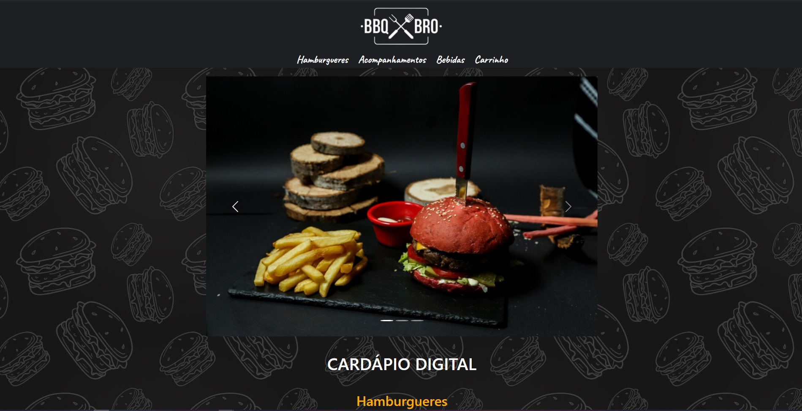
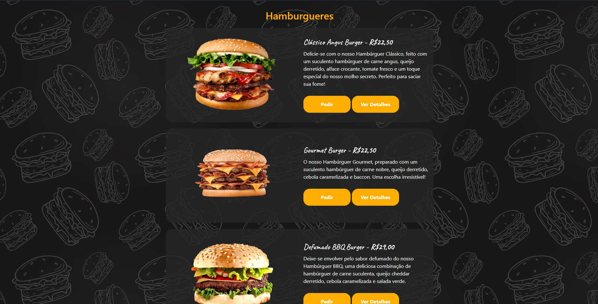
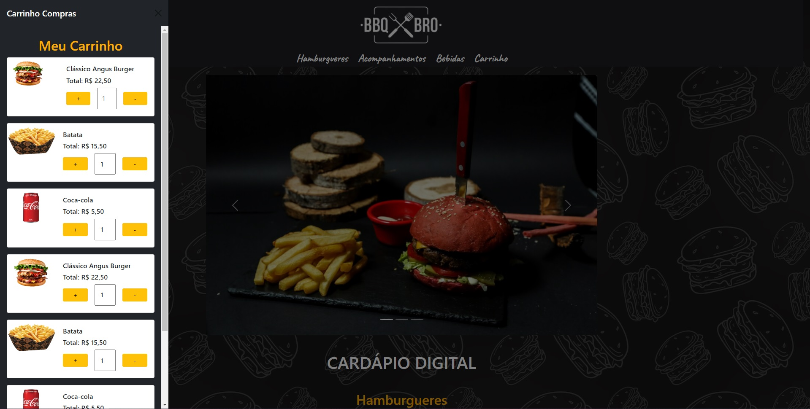
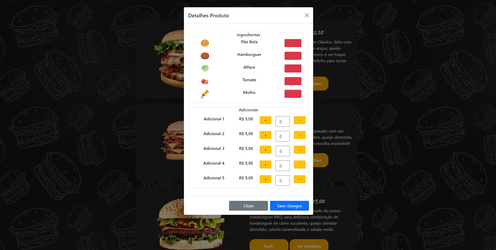

# Cardápio Digital BBQ BRO

Bem-vindo ao projeto **Cardápio Digital BBQ BRO**. Este projeto foi criado como parte do curso intensivo de Desenvolvimento Web Fullstack da Geração Tech e apresenta um cardápio digital para um restaurante fictício especializado em hambúrgueres, acompanhamentos e bebidas.

## Funcionalidades

- **Visualização do Cardápio**: Exibe uma lista de hamburgueres, acompanhamentos e bebidas disponíveis, com imagens e descrições.
- **Carrinho de Compras**: Permite visualizar o carrinho de compras.
- **Detalhes do Produto**: Oferece uma visão detalhada dos produtos com informações sobre ingredientes e adicionais.
- **Carrossel de Publicidade**: Exibe promoções e anúncios utilizando um carrossel de imagens.
- **Modais**: Utiliza modais para mostrar detalhes adicionais dos produtos com opções adicionais.

## Tecnologias Utilizadas

- **HTML5**: Estrutura e conteúdo da página.
- **CSS3**: Estilização dos componentes e layout.
- **Bootstrap 5**: Framework para estilização e componentes responsivos.
- **JavaScript**: Funcionalidades interativas, como carrosséis e modais.
- **jQuery**: Utilizado para manipulação de DOM e interatividade.

## Estrutura do Projeto

- **index.html**: Página principal contendo a estrutura HTML e links para arquivos CSS e JavaScript.
- **style.css**: Arquivo de estilização para o layout e aparência personalizada.
- **imagens/**: Pasta contendo imagens usadas no projeto, incluindo logotipo, produtos e promoções.

## Exemplo de Tela

### Página Principal




### Carrinho de Compras



### Detalhes do Produto



## Demonstração Online

Você pode visualizar o cardápio digital ao vivo [aqui](https://cardapiodigital-duarte-gt.netlify.app/).

## Instalação

Para visualizar e testar o projeto localmente, siga estas etapas:

1. Clone o repositório:
   ```bash
   git clone https://github.com/duartetech/cardapioDigital.git
   ```

2. Navegue até o diretório do projeto:
   ```bash
   cd cardapioDigital
   ```

3. Abra o arquivo `index.html` em um navegador para visualizar o projeto.
